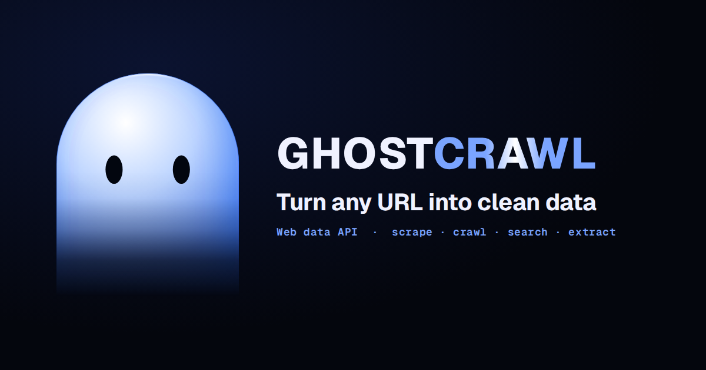

<div align="center">



# GhostCrawl

### Authentic, reliable web data at scale.

Real Chrome, Firefox, and WebKit browsers in the cloud — so your agents and
scrapers get reliable page results without managing a single browser, queue, or exit.

[](LICENSE)
[](https://pypi.org/project/ghostcrawl/)
[](https://www.npmjs.com/package/@ghostcrawl/sdk)
[](https://docs.ghostcrawl.io)
[](https://mcp.ghostcrawl.io)

[Website](https://ghostcrawl.io) ·
[Documentation](https://docs.ghostcrawl.io) ·
[API](https://api.ghostcrawl.io) ·
[MCP](https://mcp.ghostcrawl.io) ·
[Examples](examples/)

</div>

---

## What is GhostCrawl?

GhostCrawl is a web-data API for crawling, scraping, structured extraction, and
full browser automation. You send a URL or a goal; GhostCrawl drives a real
browser, gets through, and returns clean results — HTML, Markdown, screenshots,
or structured JSON.

It works two ways, same API and SDKs for both:

- **Managed cloud** — point a client at `api.ghostcrawl.io` and go. We run the
  browsers, pick the engine, and route every request automatically. Nothing to
  operate.
- **Self-host** — run the container on your own machine, your own IP, your own
  data. Free forever.

GhostCrawl is **MCP-native**: every capability is exposed as a Model Context
Protocol surface, so any agent can drive it directly.

---

## Why GhostCrawl?

- **It gets through.** Pages render and return authentic results where ordinary
  headless setups get blocked or fed altered content.
- **Three real engines.** Chrome, Firefox, and WebKit — pick one or let
  `auto` choose. The same site looks the same to GhostCrawl as it does to a
  real visitor.
- **Zero browser ops.** No queues, no exits to rotate, no fleet to babysit. On
  cloud, that's all included; routing rotates automatically.
- **One API, every workflow.** Scrape, crawl, extract structured data, control a
  live session, run SERP queries, store results — one consistent surface.
- **MCP-native.** The full user API is available to agents over MCP out of the box.
- **Typed SDKs.** First-class SDKs for Python, Node/TypeScript, Go, Java, C#,
  Ruby, and PHP — plus a CLI and LangChain & Scrapy integrations.
- **Run it free.** The self-host image is free; the cloud adds managed routing,
  higher concurrency, and live session view.

---

## Capabilities

| Capability | What it does |
|------------|--------------|
| **Scrape** | Fetch a single page rendered by a real browser → HTML / Markdown / text. |
| **Crawl** | Follow links from a seed URL with depth and page limits; resumable runs. |
| **Extract** | Pull structured JSON from a page against a schema you provide. |
| **Browser control** | Drive a live session: navigate, click, type, scroll, screenshot. |
| **Agent (MCP)** | Give an agent a goal; it navigates and acts to complete it. |
| **Search / SERP** | Query search engines and verticals (web, news, shopping, and more). |
| **Sessions** | Sticky, reusable browser sessions with consistent identity. |
| **Identity profiles** | Persistent, coherent browser identities that survive across runs. |
| **Storage** | Datasets, screenshots, and recordings, managed for you. |
| **Geo targeting** | Route requests from the region you need. |

---

## Quickstart

### 1. Get an API key

Create an account at [ghostcrawl.io](https://ghostcrawl.io), verify your email,
log in, and mint a key from your dashboard. Keys look like `gck_live_…` and are
sent as a bearer token on every request.

### 2. Call the API

**curl:**

```bash
curl https://api.ghostcrawl.io/v1/scrape \
  -H "Authorization: Bearer $GHOSTCRAWL_API_KEY" \
  -H "Content-Type: application/json" \
  -d '{"url": "https://example.com", "engine": "chrome"}'
```

**Python** ([`ghostcrawl`](https://pypi.org/project/ghostcrawl/)):

```bash
pip install ghostcrawl
```

```python
import asyncio
from ghostcrawl import GhostcrawlClient

async def main():
    async with GhostcrawlClient(api_key="gck_live_...") as client:
        result = await client.scrape(url="https://example.com", engine="chrome")
        print(result["content"])

asyncio.run(main())
```

**Node / TypeScript** ([`@ghostcrawl/sdk`](https://www.npmjs.com/package/@ghostcrawl/sdk)):

```bash
npm install @ghostcrawl/sdk
```

```typescript
import { createGhostcrawlClient } from '@ghostcrawl/sdk';

const client = createGhostcrawlClient({ token: process.env.GHOSTCRAWL_API_KEY });
const result = await client.scrape({ url: 'https://example.com', engine: 'chrome' });
console.log(result.content);
```

**CLI** ([`@ghostcrawl/cli`](https://www.npmjs.com/package/@ghostcrawl/cli)):

```bash
npm install -g @ghostcrawl/cli
ghostcrawl scrape https://example.com --format markdown
```

**LangChain** ([`ghostcrawl-langchain`](https://pypi.org/project/ghostcrawl-langchain/)):

```bash
pip install ghostcrawl-langchain
```

```python
import os
os.environ["GHOSTCRAWL_API_KEY"] = "gck_live_..."

from ghostcrawl_langchain import GhostcrawlScrapeTool

tool = GhostcrawlScrapeTool()
print(tool.invoke({"url": "https://example.com"}))
```

Runnable versions of every snippet — plus crawl, extract, agent, and MCP
examples — live in [`examples/`](examples/).

---

## Use it from an agent (MCP)

GhostCrawl's full user API is available over MCP. Point any MCP-capable agent at
`mcp.ghostcrawl.io` with your API key:

```json
{
  "mcpServers": {
    "ghostcrawl": {
      "url": "https://mcp.ghostcrawl.io",
      "headers": {
        "Authorization": "Bearer gck_live_..."
      }
    }
  }
}
```

The MCP surface exposes navigate, act, extract, screenshot, scrape, crawl, and
more — the same managed browsers behind the REST API. See
[`examples/mcp/`](examples/mcp/).

---

## Self-host (free)

Run GhostCrawl on your own machine. Your compute, your IP, your data.

```bash
# Copy the template, set GHOSTCRAWL_API_KEY in a .env file beside it, then:
cp docker-compose.yml.template docker-compose.yml
echo "GHOSTCRAWL_API_KEY=gck_live_..." > .env
docker compose up -d          # launch locally
docker compose logs -f        # follow the logs
```

A self-hosted instance exposes its own local API (`http://localhost:8000`), MCP
(`http://localhost:3143`), and dashboard so you can drive and watch live sessions
on your own hardware. The image validates your API key online each time it starts.

See [`docker-compose.yml.template`](docker-compose.yml.template) and the
[self-host guide](docs/usage-selfhost.md) for the full flow.

> Managed exit routing is a cloud-only feature. Self-host requests egress from
> your own machine's network.

> The self-host image is proprietary software, provided free for self-hosting
> under the [GhostCrawl Software License](https://docs.ghostcrawl.io/legal/eula).

---

## Pricing

| Plan | Price | Deployment | Highlights |
|------|-------|------------|------------|
| **Free** | $0 | Self-host | Run it yourself; all three engines; community support. |
| **Pro** | $19/mo | Cloud | Managed cloud, up to 10 concurrent crawls, sticky sessions, geo targeting. |
| **Growth** | $39/mo | Cloud | Up to 25 concurrent crawls, full managed browsing behavior. |
| **Scale** | $79/mo | Cloud | Up to 50 concurrent crawls, full managed browsing behavior, high volume. |
| **Enterprise** | Custom | Cloud | High volume, dedicated support + SLA. |

All cloud plans include a 14-day free trial. Managed browsing behavior is
included on every paid plan, and you can bring your own behavior scripts on any
plan. See [ghostcrawl.io](https://ghostcrawl.io) for the full, current pricing.

---

## SDKs

| Language | Package | Install |
|----------|---------|---------|
| Python | [`ghostcrawl`](https://pypi.org/project/ghostcrawl/) | `pip install ghostcrawl` |
| Node / TypeScript | [`@ghostcrawl/sdk`](https://www.npmjs.com/package/@ghostcrawl/sdk) | `npm install @ghostcrawl/sdk` |
| Go | `ghostcrawl-go` | `go get github.com/GhostCrawl/ghostcrawl-go` |
| Java | `io.ghostcrawl:ghostcrawl-java` | Maven / Gradle |
| C# / .NET | [`GhostcrawlApi`](https://www.nuget.org/packages/GhostcrawlApi/) | `dotnet add package GhostcrawlApi` |
| Ruby | [`ghostcrawl`](https://rubygems.org/gems/ghostcrawl) | `gem install ghostcrawl` |
| PHP | [`ghostcrawl/ghostcrawl`](https://packagist.org/packages/ghostcrawl/ghostcrawl) | `composer require ghostcrawl/ghostcrawl` |
| CLI | [`@ghostcrawl/cli`](https://www.npmjs.com/package/@ghostcrawl/cli) | `npm install -g @ghostcrawl/cli` |
| LangChain | [`ghostcrawl-langchain`](https://pypi.org/project/ghostcrawl-langchain/) | `pip install ghostcrawl-langchain` |
| Scrapy | [`ghostcrawl-scrapy`](https://pypi.org/project/ghostcrawl-scrapy/) | `pip install ghostcrawl-scrapy` |

All SDKs are generated from the same API contract and share one consistent
surface. The SDKs, CLI, and self-host image are proprietary software, licensed
for use with the GhostCrawl service — see [LICENSE](LICENSE).

---

## Documentation

- [Install](docs/install.md) — SDKs and the self-host CLI flow.
- [Cloud usage](docs/usage-cloud.md) — managed API + MCP, auth, engine selection.
- [Self-host usage](docs/usage-selfhost.md) — running the image locally.
- [Examples](examples/) — runnable snippets for every SDK, the CLI, curl, and MCP.

Full API reference and interactive examples live at
[docs.ghostcrawl.io](https://docs.ghostcrawl.io).

---

## Contributing & Security

- Issues, bug reports, and feedback are welcome — see
  [CONTRIBUTING.md](CONTRIBUTING.md).
- Found a vulnerability? Please report it privately — see
  [SECURITY.md](.github/SECURITY.md).

## Support

Open an issue on this repository, or email
[contact@ghostcrawl.io](mailto:contact@ghostcrawl.io).

## License

GhostCrawl is proprietary software. © 2026 GhostCrawl, LLC. All rights reserved.

The SDKs, CLI, example code, and self-host image are **licensed, not sold** — for
use with the GhostCrawl service under the [GhostCrawl Software License](LICENSE)
and the [Terms of Service](https://docs.ghostcrawl.io/legal/terms). You may use
them to access GhostCrawl under a valid account; you may **not** copy (except as
needed to use), modify, redistribute, sell, sublicense, reverse-engineer, or
tamper with them. No rights are granted except as expressly stated.
